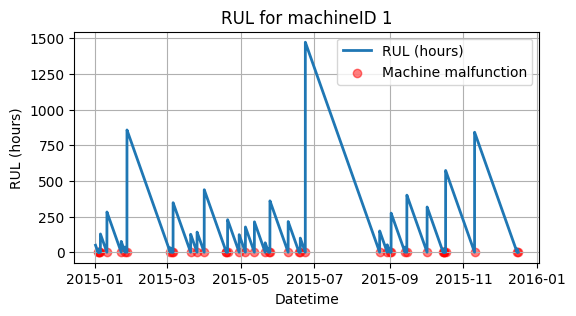
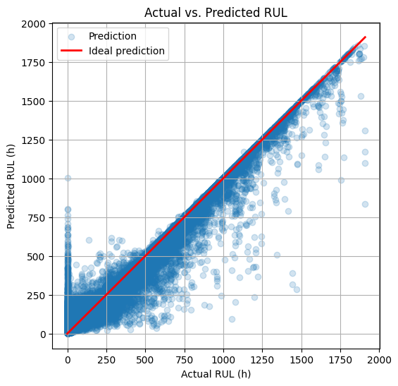

# Random-Forest-Regression-for-Predictive-Maintenance
### Predicting the Remaining Useful Life using Random Forest Regression

This project was developed as part of the course **'Projektstudium'** at **OTH Regensburg**.

It's goal is to use **Random Forest Regression** to predict the **Remaining Useful Life (RUL)** of machines based on historical sensor data as well as malfunction logs.

---

### Overview

The project includes:
- Data loading and pre-processing
- Exploratory data analysis (EDA)
- RUL calculation
- Model development using a Random Forest Regressor
- Evaluation of model performance
- Discussion of results and practical implications

---

### Dataset

The dataset used in this project is available on Kaggle:

https://www.kaggle.com/datasets/arnabbiswas1/microsoft-azure-predictive-maintenance?select=PdM_errors.csv

(Note: Because of it's large size, the dataset “PdM_telemetry.csv” contained in this repository is a smaller subset of the original dataset. The complete dataset (on which the random forest model was trained) is available at the specified Kaggle link.) 

---

### Technologies Used
- Python
- Jupyter Notebook
- pandas
- numPy
- matplotlib
- scikit-learn

---

### Project Steps

**1. Data Loading, Pre-processing & EDA**
- Importing and merging datasets
- Handling missing values
- Exploratory analysis to understand the data

**2. Calculating the Remaining Useful Life (RUL)**
Since the RUL is not provided as part of the dataset, it is computed as follows:

RUL = time of the next malfunction - current time

**3. Random Forest Regression**
- Feature selection and engineering
- Splitting the dataset into a test- and train-set
- Model training using `RandomForestRegressor`
- Model evaluation using the metrics R² (R-squared) and MAE (Mean average error)

---

### Results and practical implications

**Results:**

High R²-score: the model reliably predicts the trends in the data.

Low MAE: the average prediction error is relatively small (considering the RUL goes up to almost 2.000 hours).

**Practical implications:**

With an MAE of roughly +/- 11 hours, maintenance activities can be scheduled in advance with an accuracy of roughly half a day.
The implemented model could be used to support maintenance planning. If malfunctions are critical, maintenance activities should be scheduled at least 11 hours before the predicted malfunction in order to account for the MAE.
For example: If the predicted RUL is 100 hours, the actual RUL will be between 89 and 111 hours on average. Therefore, it makes sense to perform maintenance within the next 89 hours.
Depending of the criticality and risk of potential malfunctions, additional measures - such as manual monitoring - should be employed together with such a prediction model.
Comparison to other maintenance strategies:

Reactive maintenance: Unlike reactive maintenance, the implemented random forest model allows the anticipation of malfunctions, before they happen. Therefore unplanned downtimes can be avoided by taking maintenance actions in advance.

Preventive maintenance: Unlike fixed-interval schedules (preventive maintenance), the implemented random forest model aligns maintenance activities with the actual machine-conditions. Therefore unnecessary maintenance activities can be reduced.

**Limitations:**

The MAE of 11 hours could be critical in production systems with high risk and is potentially not sufficient.

